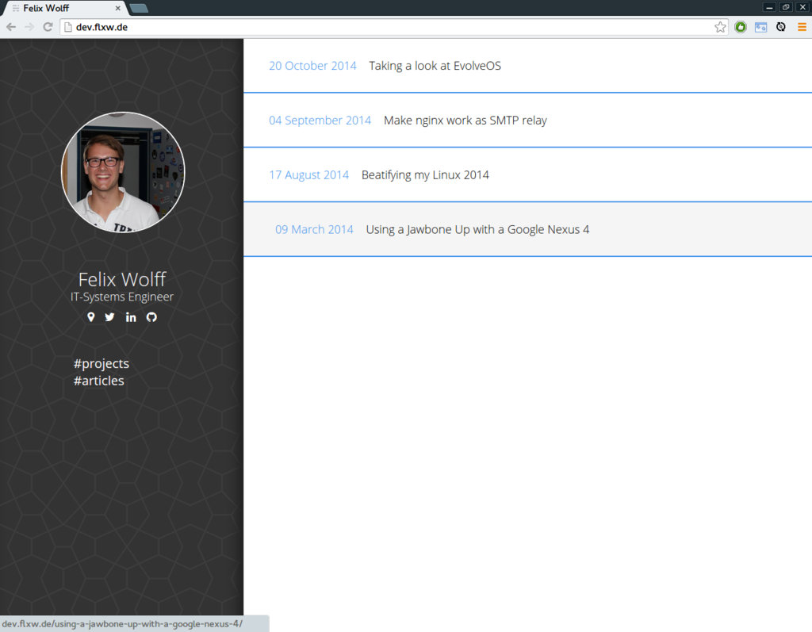

# developium
A mobile-first, lightweight Ghost theme for presenting oneself as developer and blogger

1. Download the [latest release](https://github.com/flxw/developium/releases/latest)
2. Unzip it into `ghost/content/themes`
3. Open your blog administration panel and select the `developium` theme
4. Tweak to suit your needs
